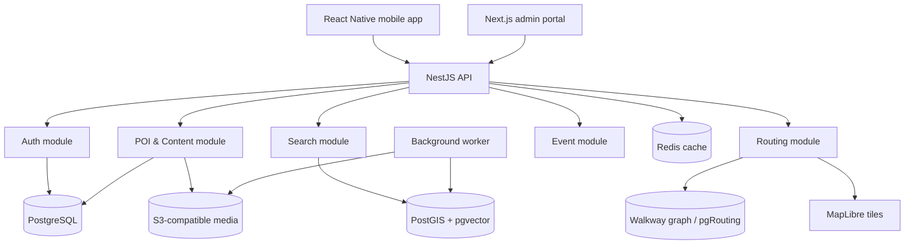
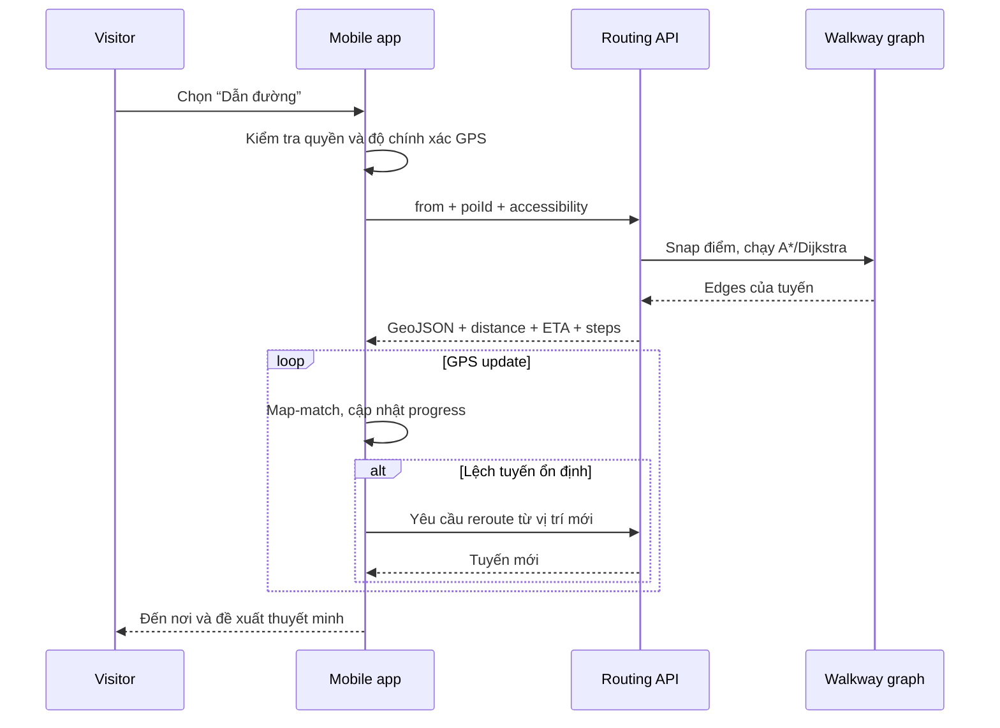

# Kế hoạch dự án: Dam Sen Smart Guide

## 1. Mục tiêu sản phẩm

Xây dựng ứng dụng hướng dẫn tham quan Công viên Văn hóa Đầm Sen với ba năng lực chính:

1. Hiển thị bản đồ nội khu và vị trí GPS hiện tại của khách.
2. Khám phá, tìm kiếm và nhận gợi ý các POI (Point of Interest — điểm đáng chú ý).
3. Thuyết minh đa ngôn ngữ và dẫn đường đi bộ theo thời gian thực từ vị trí hiện tại đến POI.

Hệ thống có hai nhóm actor chính:

- **Visitor**: có thể dùng ẩn danh hoặc đăng ký/đăng nhập để lưu yêu thích, lịch sử và ngôn ngữ.
- **Admin**: tạo/sửa POI, quản lý bản dịch và audio, gửi nội dung duyệt, duyệt/xuất bản hoặc gỡ nội dung.

> “Guest login/signup” nên được mô hình hóa thành một actor `Visitor` với hai trạng thái: `anonymous` và `authenticated`. Admin là actor riêng và phải được phân quyền.

## 2. Phạm vi theo giai đoạn

### MVP — phải hoàn thành trước

- Đăng ký, đăng nhập, refresh token và tiếp tục dùng ẩn danh.
- Bản đồ Đầm Sen, marker POI, marker vị trí hiện tại.
- Danh sách POI theo khoảng cách và danh mục.
- Tìm kiếm từ khóa có dấu/không dấu.
- Trang chi tiết POI, ảnh, giờ hoạt động, nội dung đa ngôn ngữ.
- Phát audio thuyết minh; dùng audio thu sẵn hoặc TTS đã tạo trước.
- Chọn POI và dẫn đường đi bộ trong công viên.
- Cập nhật GPS, hiển thị quãng đường/ETA, phát hiện đi sai đường và tính lại tuyến.
- Admin CRUD POI, bản dịch, media; workflow `draft -> pending_review -> published/rejected`.
- Log sự kiện cơ bản: xem POI, bắt đầu/kết thúc audio, bắt đầu/kết thúc dẫn đường.

### V1 — sau khi MVP ổn định

- Semantic search đa ngôn ngữ.
- Gợi ý theo sở thích, khoảng cách, trạng thái mở cửa và độ phổ biến.
- Geofence: tự gợi ý/thông báo khi khách đến gần POI.
- Đánh giá, yêu thích, lịch sử khám phá.
- Tải bản đồ, tuyến và audio để dùng khi mạng yếu.
- Dashboard thống kê cho admin.

### V2 — chỉ thêm khi có nhu cầu và dữ liệu

- Stream processing, heatmap gần thời gian thực và cảnh báo khu vực đông.
- LTR/neural re-ranking, cá nhân hóa nâng cao.
- Knowledge graph liên kết chủ đề, nhân vật, khu vực và hành trình.
- A/B testing thứ tự gợi ý.

## 3. Kiến trúc đề xuất



### Vì sao dùng modular monolith?

Một backend duy nhất nhưng chia module rõ ràng giúp dễ học, debug, test và deploy. Ranh giới module vẫn cho phép tách thành microservice sau này. Với một công viên, Kafka + Flink + nhiều database làm tăng độ phức tạp vận hành nhưng chưa tạo giá trị tương xứng.

### Tech stack cụ thể

| Lớp | Công nghệ đề xuất | Lý do |
|---|---|---|
| Mobile | React Native + Expo, TypeScript | Một codebase iOS/Android, dễ dùng GPS, audio, notification |
| Admin web | Next.js + TypeScript | Form, bảng dữ liệu, RBAC và dashboard thuận tiện |
| Map | MapLibre GL; tile từ MapTiler/self-hosted | Không khóa chặt nhà cung cấp; hỗ trợ GeoJSON và custom layer |
| Backend | NestJS + TypeScript | Module hóa tốt, validation, OpenAPI, WebSocket/SSE nếu cần |
| Database | PostgreSQL + PostGIS | Dữ liệu nghiệp vụ và truy vấn không gian trong một hệ thống |
| Vector search | pgvector | Đủ cho quy mô POI của một công viên, không cần Elasticsearch ban đầu |
| Routing | pgRouting hoặc GraphHopper; dữ liệu walkway riêng | Có thể định tuyến trên đường nội bộ chưa đầy đủ trên bản đồ công cộng |
| Cache/job | Redis + BullMQ | Cache POI, rate limit, hàng đợi tạo embedding/audio |
| Media | S3-compatible storage | Ảnh và audio không nên lưu trực tiếp trong database |
| CI/CD | GitHub Actions + Docker | Tự động lint, test, build và deploy |
| Observability | OpenTelemetry + Sentry + Grafana | Theo dõi lỗi, latency và luồng request |

## 4. Ánh xạ với kiến trúc trong hình

| Thành phần trong hình | MVP nên dùng | Khi nào nâng cấp |
|---|---|---|
| API Gateway/Kong | NestJS + Nginx/load balancer | Thêm Kong khi có nhiều service/client và policy phức tạp |
| Kafka/Pulsar | Bảng `analytics_events` + queue BullMQ | Khi event rất lớn hoặc nhiều consumer độc lập |
| Flink | Job tổng hợp định kỳ | Khi cần heatmap/độ phổ biến theo giây |
| Elasticsearch/OpenSearch | Postgres full-text + pgvector + PostGIS | Khi corpus lớn, cần typo/facet/ranking phức tạp |
| Neo4j | Quan hệ bằng bảng PostgreSQL | Khi graph traversal trở thành use case quan trọng |
| Redis Geo | PostGIS; Redis chỉ cache | Khi cần theo dõi lượng lớn vị trí đồng thời |
| Feast/Hopsworks | Bảng feature đơn giản | Khi có nhiều model ML online/offline |
| LTR/neural ranker | Công thức xếp hạng có trọng số | Khi có đủ click/navigation feedback để huấn luyện |

## 5. Thiết kế Frontend

### Mobile app

Các màn hình:

1. Splash/onboarding: chọn ngôn ngữ, giải thích quyền vị trí.
2. Login/signup/continue as guest.
3. Home map: vị trí hiện tại, marker POI, filter, search và bottom sheet.
4. Explore: danh sách gần bạn, theo danh mục, đang mở cửa.
5. POI detail: ảnh, mô tả, giờ mở cửa, audio, yêu thích, nút “Dẫn đường”.
6. Navigation: polyline, hướng tiếp theo, khoảng cách, ETA, trạng thái GPS.
7. Saved/history/profile/language.

State nên tách:

- Server state: TanStack Query.
- UI/local state: Zustand.
- Secure token: SecureStore/Keychain, không dùng plain AsyncStorage.
- Offline data: SQLite; cache POI, graph/tuyến cần thiết và audio đã tải.
- i18n giao diện: i18next. Nội dung POI lấy từ API theo locale.

GPS không nên gửi liên tục lên server. App có thể tính progress tuyến cục bộ; chỉ gửi event đã giảm tần suất khi người dùng đồng ý analytics. Các chế độ quyền cần xử lý: denied, approximate, precise, while-in-use và GPS yếu.

### Admin portal

- Dashboard số POI, nội dung chờ duyệt, nội dung thiếu bản dịch/audio.
- POI table với filter theo trạng thái/danh mục.
- Map editor: đặt marker, vẽ/chỉnh entrance hoặc polygon.
- Content editor theo từng locale.
- Upload ảnh/audio, preview và kiểm tra metadata.
- Review diff, approve/reject kèm lý do.
- Quản lý category, walkway/đường bị đóng, user và role.
- Audit log: ai thay đổi gì, lúc nào, trước/sau ra sao.

Frontend dùng generated API client từ OpenAPI để tránh lệch kiểu dữ liệu giữa FE và BE.

## 6. Thiết kế Backend theo module

### Auth & Identity

- Email/password; có thể thêm Google/Apple sau.
- Access token ngắn hạn, rotating refresh token được hash trong DB.
- RBAC: `VISITOR`, `EDITOR`, `REVIEWER`, `ADMIN`.
- Anonymous session ID có thể merge vào tài khoản sau signup.

### POI & Content

- CRUD POI, category, operating hours, tags, entrances, media.
- Bản dịch tách khỏi bản ghi POI.
- Version hóa nội dung để duyệt và rollback.
- Chỉ phiên bản `published` xuất hiện trên app.

### Search & Recommendation

- Lọc không gian, full-text, semantic vector và ranking.
- Query hiểu locale, filter category, trạng thái mở cửa, bán kính.
- Candidate retrieval trước, ranking sau để dễ giải thích và tối ưu.

### Routing

- Snap GPS và điểm đích vào node/edge gần nhất trong walkway graph.
- A* hoặc Dijkstra với trọng số chiều dài/thời gian.
- Trả GeoJSON polyline, distance, ETA và instruction.
- Khi user lệch khỏi tuyến quá ngưỡng (ví dụ 20–30 m trong nhiều GPS sample), gọi reroute.
- Admin có thể đóng edge tạm thời; route phải loại edge đó.

### Narration & Media

- Trả text/audio đúng locale; fallback theo cấu hình, ví dụ `fr -> en -> vi`.
- Ưu tiên audio đã được biên tập/thu âm.
- Nếu dùng TTS, worker tạo file trước khi publish để chất lượng ổn định và tránh latency/chi phí lúc nghe.

### Analytics

- Nhận event theo batch và không lưu GPS chính xác lâu dài nếu không cần.
- Event schema có version.
- Tách product analytics khỏi dữ liệu định danh; thiết lập retention rõ ràng.

## 7. Thiết kế cơ sở dữ liệu

### Bảng cốt lõi

| Bảng | Trường chính |
|---|---|
| `users` | id, email, password_hash, status, preferred_locale, created_at |
| `roles`, `user_roles` | role và quan hệ phân quyền |
| `refresh_tokens` | user_id, token_hash, expires_at, revoked_at |
| `pois` | id, category_id, status, location `geography(Point,4326)`, area `geometry`, created_by |
| `poi_entrances` | poi_id, location, accessibility_notes |
| `poi_translations` | poi_id, locale, name, short_description, narration_text, search_document |
| `poi_content_versions` | poi_id, version, content_json, workflow_status, reviewer_id, reason |
| `poi_media` | poi_id, type, locale, object_key, duration, alt_text, sort_order |
| `categories` | id, parent_id, icon, sort_order |
| `operating_hours` | poi_id, day_of_week/date, opens_at, closes_at, is_closed |
| `walk_nodes` | id, location `geometry(Point,4326)` |
| `walk_edges` | id, source, target, geom `geometry(LineString,4326)`, length_m, accessible, status, cost |
| `embeddings` | entity_type, entity_id, locale, model, model_version, vector `vector(n)`, content_hash |
| `favorites` | user_id, poi_id, created_at |
| `reviews` | user_id, poi_id, rating, text, status |
| `analytics_events` | event_id, anonymous/user id, event_type, payload, occurred_at, schema_version |
| `audit_logs` | actor_id, action, entity_type, entity_id, before_json, after_json, created_at |

### Index quan trọng

- `GIST (pois.location)` và `GIST (walk_edges.geom)` cho truy vấn không gian.
- `GIN (search_document)` cho full-text search.
- HNSW/IVFFlat trên `embeddings.vector` cho approximate nearest neighbor.
- Unique `(poi_id, locale)` trên `poi_translations`.
- B-tree trên `status`, `category_id`, `created_at`.

PostGIS nên phân biệt:

- `geometry`: thuận lợi cho hình học trong hệ tọa độ xác định.
- `geography`: tính khoảng cách mét trên bề mặt Trái Đất thuận tiện hơn.
- Tất cả dữ liệu GPS đầu vào dùng WGS84/SRID 4326 và phải validate latitude/longitude.

## 8. Semantic search và các khái niệm cần hiểu

### Semantic search là gì?

Semantic search tìm theo **ý nghĩa** thay vì chỉ khớp đúng từ. Ví dụ người dùng gõ “chỗ mát cho trẻ em” vẫn có thể tìm thấy POI có mô tả “khu vui chơi gia đình trong nhà”, dù hai câu không có nhiều từ giống nhau.

Luồng xử lý:

1. Ghép tên, mô tả, tag và category của POI thành tài liệu tìm kiếm.
2. Dùng embedding model đa ngôn ngữ biến tài liệu thành vector số.
3. Biến câu query thành vector bằng đúng model/version.
4. Tính độ gần, thường bằng cosine similarity.
5. Kết hợp kết quả đó với từ khóa, khoảng cách và business rules.

Mô hình phù hợp để thử nghiệm: `bge-m3` hoặc một multilingual E5 model. Cần benchmark bằng bộ query tiếng Việt/Anh thực tế trước khi chọn.

### Hybrid search

Không nên dùng semantic search một mình. Hybrid search kết hợp:

- lexical score: khớp tên/từ khóa chính xác;
- vector score: gần về ý nghĩa;
- distance score: gần vị trí hiện tại;
- open score: đang mở;
- popularity/personalization score.

Ví dụ công thức MVP:

```text
final_score = 0.35 * normalized_text_score
            + 0.30 * vector_similarity
            + 0.20 * distance_decay
            + 0.10 * open_now
            + 0.05 * popularity
```

Trọng số phải được đo bằng test set, không chọn chỉ theo cảm giác. Kết quả nên có lý do giải thích như “cách bạn 120 m” hoặc “phù hợp với tìm kiếm khu vui chơi trẻ em”.

### Spatial index

Spatial index là cấu trúc tăng tốc câu hỏi như “POI nào trong bán kính 300 m?”. PostGIS thường dùng GiST/R-tree-like index để loại nhanh vùng không liên quan, thay vì tính khoảng cách đến mọi POI.

### Geofence

Geofence là vùng ảo quanh một điểm. Khi thiết bị đi vào vùng, app có thể gợi ý POI hoặc mở CTA nghe thuyết minh. Cần hysteresis/cooldown để tránh thông báo lặp khi GPS dao động ở ranh giới.

### Map matching và snapping

GPS có sai số nên vị trí có thể nằm ngoài lối đi. Snapping đưa điểm về edge gần/phù hợp nhất. Map matching dùng nhiều GPS sample và hướng di chuyển để ước lượng đoạn đường thật mà user đang đi.

### Vector embedding

Embedding là mảng số biểu diễn ý nghĩa văn bản. Văn bản có nghĩa gần nhau thường có vector gần nhau. Vector không phải nội dung đọc được; phải lưu cả model/version và tạo lại embedding khi nội dung hoặc model thay đổi.

### Candidate retrieval và re-ranking

- Retrieval lấy nhanh một tập nhỏ ứng viên từ hàng nghìn/millions bản ghi.
- Re-ranking tính nhiều feature hơn cho tập nhỏ đó để xếp thứ tự chính xác.
- Với vài trăm POI, rule-based ranking là đủ; LTR chỉ hữu ích khi có đủ dữ liệu click/navigation có chất lượng.

## 9. API contract sơ bộ

```text
POST   /v1/auth/register
POST   /v1/auth/login
POST   /v1/auth/refresh
POST   /v1/auth/logout

GET    /v1/pois?lat=&lng=&radius=&category=&openNow=&locale=
GET    /v1/pois/:id?locale=
GET    /v1/search?q=&lat=&lng=&locale=&filters=
POST   /v1/routes                    {from, poiId, accessible}
POST   /v1/routes/recalculate        {from, routeId}
POST   /v1/events/batch
PUT    /v1/me/favorites/:poiId
DELETE /v1/me/favorites/:poiId

POST   /v1/admin/pois
PATCH  /v1/admin/pois/:id
POST   /v1/admin/pois/:id/submit
POST   /v1/admin/content/:versionId/approve
POST   /v1/admin/content/:versionId/reject
POST   /v1/admin/media/presign
PATCH  /v1/admin/walk-edges/:id/status
GET    /v1/admin/audit-logs
```

Mọi response lỗi dùng một format thống nhất: `code`, `message`, `details`, `requestId`. API được mô tả bằng OpenAPI và version qua `/v1`.

## 10. Luồng dẫn đường thời gian thực



Điểm đích nên là `poi_entrance`, không mặc định là tâm polygon của POI. ETA đi bộ có thể bắt đầu từ tốc độ 1.2–1.4 m/s rồi điều chỉnh theo accessibility và dữ liệu thực nghiệm.

## 11. Dữ liệu bản đồ và quy trình chuẩn bị

1. Xin/kiểm tra quyền sử dụng sơ đồ Đầm Sen và dữ liệu POI.
2. Lấy basemap hợp lệ từ OSM/nhà cung cấp có license phù hợp.
3. Khảo sát/digitize đường đi bộ, cổng vào POI, cầu/thang/dốc và đoạn cấm.
4. Chuẩn hóa GeoJSON, kiểm tra topology: edge phải nối đúng node, không tự cắt bất thường.
5. Import vào PostGIS/pgRouting hoặc GraphHopper.
6. Đi thực địa test GPS tại các vùng cây dày, công trình che khuất và ngã rẽ.

Đây là rủi ro kỹ thuật lớn nhất của dự án. Nếu walkway graph sai hoặc thiếu, UI đẹp và thuật toán A* đúng vẫn cho tuyến không dùng được.

## 12. Bảo mật, riêng tư và an toàn

- Chỉ xin quyền vị trí `while in use` cho tính năng cốt lõi; giải thích rõ mục đích.
- Không lưu lịch sử GPS thô mặc định. Nếu cần nghiên cứu, xin consent riêng, giảm độ chính xác và đặt retention.
- TLS, password hash Argon2id, refresh token hash, rate limiting và account lockout mềm.
- Validate MIME/size, quét file upload, dùng presigned URL.
- RBAC ở backend; không tin role gửi từ frontend.
- Audit mọi thao tác publish, reject, thay đổi route và phân quyền.
- Backup DB, kiểm thử restore và versioning media.
- Chống XSS trong rich text và tránh lộ thông tin nhạy cảm qua log.

## 13. Kiểm thử và tiêu chí chấp nhận

### Test pyramid

- Unit: ranking formula, locale fallback, operating-hours logic, route cost.
- Integration: PostGIS queries, pgvector search, auth rotation, workflow publish.
- Contract: OpenAPI giữa mobile/admin/backend.
- E2E: signup -> tìm POI -> nghe audio -> dẫn đường; admin create -> review -> publish.
- Field test: đi thực tế theo ít nhất 10 tuyến đại diện.

### Chỉ số mục tiêu ban đầu

- API p95 dưới 500 ms cho POI/search thông thường.
- Route response p95 dưới 1 giây ở quy mô graph nội khu.
- Crash-free session trên 99.5%.
- POI published có đủ tọa độ, entrance, ít nhất một locale và media bắt buộc.
- Route completion rate, search success rate và audio completion rate được đo nhưng không hy sinh riêng tư.
- GPS accuracy thấp phải có cảnh báo và không đưa chỉ dẫn quá tự tin.

### Đánh giá search

Tạo bộ 50–100 query thật bằng tiếng Việt/Anh, gán POI đúng và đo:

- Recall@10: POI đúng có nằm trong top 10 không?
- MRR: POI đúng xuất hiện sớm đến mức nào?
- nDCG@10: thứ tự kết quả có phù hợp nhiều mức liên quan không?
- Zero-result rate và tỷ lệ user phải sửa query.

## 14. Kế hoạch triển khai 12 tuần

| Tuần | Deliverable |
|---|---|
| 1 | Chốt user story, wireframe, khảo sát dữ liệu/giấy phép, ADR cho stack |
| 2 | Monorepo, Docker, CI, PostgreSQL/PostGIS, auth schema, OpenAPI base |
| 3 | Admin CRUD POI/category/translation, upload media |
| 4 | Mobile map, GPS permission/state, POI markers/list/detail |
| 5 | Operating hours, locale fallback, audio player, content workflow |
| 6 | Digitize/import walkway graph, topology validation |
| 7 | Routing API A*/pgRouting, entrance snapping, polyline/ETA |
| 8 | Navigation UI, off-route detection, rerouting, GPS simulation test |
| 9 | Full-text search, filters, distance/open-now ranking |
| 10 | pgvector semantic/hybrid search, evaluation dataset và benchmark |
| 11 | Offline cache, security hardening, audit log, analytics tối thiểu |
| 12 | Load/E2E/field test, bug fixing, deploy staging và demo |

Với một người vừa học vừa làm, lịch thực tế hơn là 18–24 tuần. Có thể giữ mốc 12 sprint, mỗi sprint 1–2 tuần.

## 15. Cấu trúc repository

```text
damsen-smart-guide/
  apps/
    mobile/              # React Native/Expo
    admin-web/           # Next.js
    api/                 # NestJS
    worker/              # embedding, TTS, media jobs
  packages/
    api-client/          # generated from OpenAPI
    shared-types/
    ui/
    config/
  infra/
    docker/
    migrations/
    monitoring/
  data/
    geojson/             # versioned source data, license metadata
    search-evaluation/
  docs/
    adr/
    api/
    product/
```

## 16. Backlog theo epic

1. Identity & consent.
2. POI and multilingual CMS.
3. Map and location.
4. Indoor-park walking graph and routing.
5. Narration and media.
6. Search and recommendation.
7. Admin review and audit.
8. Offline resilience.
9. Analytics and privacy.
10. DevOps, security and observability.

Mỗi story cần có acceptance criteria, mock/API contract và test tương ứng. Nên viết ADR cho các quyết định lớn: nhà cung cấp map, routing engine, TTS/audio, embedding model và chính sách lưu GPS.

## 17. Definition of Done cho MVP

MVP được xem là hoàn thành khi:

- Visitor có thể mở app, cấp quyền GPS, thấy vị trí và POI.
- Tìm một POI bằng tên hoặc nhu cầu đơn giản và xem đúng locale.
- Phát được thuyết minh, kể cả khi mạng chập chờn nếu audio đã cache.
- Tạo được tuyến hợp lệ từ vị trí đang đứng đến đúng entrance của POI.
- Tuyến được cập nhật khi user di chuyển và reroute khi lệch đường.
- Admin tạo, chỉnh, gửi duyệt và publish POI mà không sửa trực tiếp DB.
- Nội dung chưa duyệt không xuất hiện trên production.
- Các luồng chính có automated tests, log/metric và xử lý lỗi GPS/network rõ ràng.
- Ít nhất 10 tuyến đã được kiểm chứng ngoài thực địa.

## 18. Bước khởi động đề xuất

Trong tuần đầu, chưa nên viết semantic search hay recommendation. Hãy tạo một vertical slice hoàn chỉnh với 5 POI giả lập:

1. Admin tạo POI + bản dịch + entrance.
2. Mobile tải và hiển thị POI trên map.
3. User mở chi tiết và nghe một audio mẫu.
4. Backend tính một tuyến trên graph nhỏ.
5. Mobile hiển thị tuyến và mô phỏng GPS di chuyển.

Vertical slice này kiểm chứng rủi ro lớn nhất — dữ liệu bản đồ, GPS và routing — trước khi đầu tư vào các tầng ML nâng cao.
