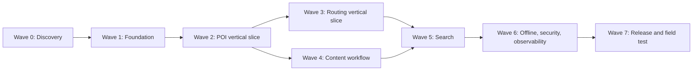

# Agent Execution Plan — Dam Sen Smart Guide

Tài liệu này biến [PROJECT_PLAN.md](../PROJECT_PLAN.md) thành các work package có dependency và checklist. Agent phải tuân theo [AGENTS.md](../AGENTS.md), xem task hiện tại trong [STATUS.md](STATUS.md) và tra [FEATURE_REGISTRY.md](FEATURE_REGISTRY.md) trước khi implementation.

## 1. Nguyên tắc điều phối

### Vai trò

- **Coordinator/Architect**: chia task packet, khóa contract, quản lý dependency và review tích hợp.
- **Foundation/Platform agent**: monorepo, config, shared contract, CI.
- **API agent**: auth, POI, workflow, routing/search endpoint.
- **Mobile agent**: app visitor, map, GPS, audio, navigation, offline.
- **Admin agent**: CMS, map editor, review và audit UI.
- **Geo agent**: dữ liệu bản đồ, walkway graph, topology và routing validation.
- **Search/ML agent**: lexical, embedding, hybrid ranking và evaluation.
- **QA/DevOps agent**: test harness, observability, deploy/staging và field-test protocol.

Một agent có thể giữ nhiều vai trò theo thời điểm, nhưng một task chỉ có một owner. Không giao hai agent sửa cùng module trong cùng wave.

### Trạng thái task

`TODO -> READY -> IN_PROGRESS -> REVIEW -> DONE`, hoặc `BLOCKED`.

- `READY`: dependency hoàn tất và task packet đủ.
- `DONE`: acceptance checklist + verification đều đạt.
- Chỉ coordinator thay đổi dependency/contract xuyên module.

### Cách chạy song song

Mỗi wave có thể chạy song song các task không chung file và không phụ thuộc kết quả chưa ổn định. Sau wave phải có integration gate trước khi mở wave tiếp theo.

## 2. Checklist của coordinator

### Trước mỗi wave

- [ ] Chọn các task có dependency `DONE`.
- [ ] Điền task packet cho từng agent.
- [ ] Chỉ định rõ file/module ownership.
- [ ] Chốt OpenAPI/schema/shared type liên quan.
- [ ] Xác nhận không có hai agent sửa cùng shared file.
- [ ] Gắn link required reading cụ thể, không yêu cầu đọc toàn bộ plan.

### Sau mỗi wave

- [ ] Thu handoff theo format trong `AGENTS.md`.
- [ ] Kiểm tra status trong feature registry.
- [ ] Chạy integration gate.
- [ ] Giải quyết drift giữa OpenAPI, generated client, migration và UI.
- [ ] Ghi ADR nếu quyết định kiến trúc mới phát sinh.
- [ ] Mở task tiếp theo chỉ khi contract upstream ổn định.

## 3. Task graph tổng quát



### T35-OSM — OSM research POIs and walkway overlay

```text
Task ID: T35-OSM
Goal: Replace the visitor demo grid with public-map-referenced Dam Sen POIs and walkways.
In scope: five dev POIs, OSM walkway snapshot, in-memory research routing, visitor overlay and attribution.
Out of scope: claiming official/field-verified navigation, production release, replacing the PostgreSQL routing migration.
Dependencies completed: T21, T33, T35.
Files/modules allowed: apps/api/src/poi, apps/api/src/routing, apps/api/test, apps/visitor-web, docs.
Contracts consumed: existing POI, narration and POST /v1/routes contracts.
Contracts produced: no public schema change; updated local fixture content and research geometry.
Required reading: AGENTS.md, docs/STATUS.md, ADR-0002, VISITOR-WEB/ROUTE-API registry entries.
Acceptance checks: real public references, visible attribution/warning, connected path graph, no unverified accessibility claim.
Verification commands: API typecheck/test; visitor lint/typecheck/test/build.
```

- [x] Reuse MapLibre, POI API, narration and routing contracts.
- [x] Record OSM provenance and retrieval date.
- [x] Keep field-verification warning visible.
- [x] Verify all five destinations share one connected research graph.
- [x] Run scoped quality checks.

### T35-SIM — Browser walking simulation and arrival narration

```text
Task ID: T35-SIM
Goal: Let a learner place a simulated visitor, walk a route in 1–3 metre steps, and hear narration on arrival.
In scope: map placement mode, simulated marker, route progress controls, arrival dialog and browser TTS.
Out of scope: background autoplay, real GPS spoofing, server persistence and authoritative navigation.
Dependencies completed: T24–T25, T33, T35-OSM.
Files/modules allowed: apps/visitor-web/**, docs/FEATURE_REGISTRY.md, docs/STATUS.md.
Contracts consumed: GeoPoint, RouteResponse and PoiNarration.
Contracts produced: reusable route interpolation helper; no API/schema change.
Required reading: AGENTS.md, apps/visitor-web/AGENTS.md, docs/STATUS.md, VISITOR-WEB/NARRATION/ROUTE-API registry entries.
Acceptance checks: click-to-place; route from simulation; exact 1/2/3 m step; marker follows route; arrival dialog; TTS with replay/stop; GPS remains separate.
Verification commands: visitor lint, typecheck, unit tests and production build.
```

- [x] Reuse the existing MapLibre marker, route API and narration transcript.
- [x] Keep simulation state local to the browser.
- [x] Cover distance interpolation and completion with unit tests.
- [x] Handle unsupported Web Speech without breaking arrival UX.
- [x] Run scoped quality checks and update registry/status.

### T35-SIM3 — Collapsible simulation controls

```text
Task ID: T35-SIM3
Goal: Keep simulation controls from obscuring the map.
In scope: compact-by-default panel, accessible expand/collapse control and responsive styling.
Out of scope: persisted panel layout and freeform drag positioning.
Dependencies completed: T35-SIM2.
Files/modules allowed: apps/visitor-web/**, docs/FEATURE_REGISTRY.md, docs/STATUS.md.
Contracts consumed: WALK-SIMULATOR browser state.
Contracts produced: none.
Required reading: AGENTS.md, apps/visitor-web/AGENTS.md, WALK-SIMULATOR registry entry.
Acceptance checks: panel starts compact; can expand/collapse; walking progress remains readable; map controls remain usable.
Verification commands: visitor lint, typecheck, unit tests and production build.
```

- [x] Add an accessible compact/expanded state.
- [x] Keep essential simulation status visible while compact.
- [x] Verify responsive layout and scoped quality checks.

### T35-SIM4 — Preserve simulation map zoom

```text
Task ID: T35-SIM4
Goal: Prevent automatic zoom-out when simulated guidance starts.
In scope: route viewport policy for simulated versus real-GPS navigation.
Out of scope: camera-follow mode and persisted zoom preferences.
Dependencies completed: T35-SIM3.
Files/modules allowed: apps/visitor-web/**, docs/FEATURE_REGISTRY.md, docs/STATUS.md.
Contracts consumed: WALK-SIMULATOR browser state.
Contracts produced: none.
Required reading: AGENTS.md, apps/visitor-web/AGENTS.md, WALK-SIMULATOR registry entry.
Acceptance checks: simulated route preserves current zoom; real-GPS route may still fit the route bounds.
Verification commands: visitor lint, typecheck, unit tests and production build.
```

- [x] Apply viewport fitting only to real-GPS routes.
- [x] Run scoped quality checks and update handoff docs.

### T35-SIM2 — Automatic five-second chibi route playback

```text
Task ID: T35-SIM2
Goal: Turn the browser simulator into a smooth five-second automatic walk with a custom chibi avatar.
In scope: close POI detail when guidance starts, time-based route interpolation, animated chibi marker, arrival dialog and automatic TTS.
Out of scope: real GPS spoofing, persisted simulation sessions, authoritative pedestrian speed and sprite-sheet character customization.
Dependencies completed: T35-SIM.
Files/modules allowed: apps/visitor-web/**, docs/FEATURE_REGISTRY.md, docs/STATUS.md.
Contracts consumed: RouteResponse, GeoPoint and approved PoiNarration transcript.
Contracts produced: reusable elapsed-time-to-route-distance helper; no API/schema change.
Required reading: AGENTS.md, apps/visitor-web/AGENTS.md, docs/STATUS.md, WALK-SIMULATOR registry entry.
Acceptance checks: detail closes on route start; simulated marker completes any route in 5 seconds; distance is derived from elapsed time; chibi walk animation is smooth; arrival dialog and TTS still trigger.
Verification commands: visitor lint, typecheck, unit tests and production build.
```

- [x] Reuse the route API, interpolation helper, arrival dialog and Web Speech flow.
- [x] Replace manual 1/2/3 m controls with elapsed-time playback.
- [x] Use the generated transparent indie spritesheet and CSS walk cycle.
- [x] Cover time-to-distance clamping with unit tests.
- [x] Run scoped quality checks and update registry/status.

## 4. Wave 0 — Discovery và quyết định khóa

### T00 — Product contract và sample data

Owner: Coordinator. Required reading: `PROJECT_PLAN.md` sections 1, 2, 17, 18.

- [ ] Chuyển MVP thành user stories có acceptance criteria.
- [ ] Chốt locale MVP, đề xuất `vi` và `en`.
- [ ] Chốt 5 POI mẫu và dữ liệu giả hợp pháp.
- [ ] Chốt anonymous/authenticated behavior.
- [ ] Chốt privacy policy sơ bộ cho GPS/event.
- [ ] Đánh dấu rõ feature ngoài MVP.

Output: `docs/product/MVP_SCOPE.md`, seed specification. Gate: không còn requirement mơ hồ cản vertical slice.

### T00A — ADR stack và nhà cung cấp

Owner: Coordinator/Platform. Required reading: sections 3, 4, 11, 12.

- [ ] ADR mobile/admin/API/database.
- [ ] ADR map tiles + license/attribution.
- [ ] ADR routing engine: pgRouting hoặc GraphHopper.
- [ ] ADR object storage và audio/TTS.
- [ ] Xác nhận license cho tất cả dependency/data provider.

Output: `docs/adr/0001-*.md` trở đi.

### Gate W0

- [ ] MVP scope được đóng băng cho vertical slice.
- [ ] Không còn lựa chọn công nghệ cốt lõi chưa quyết định.
- [ ] Có sample POI, translation, entrance và walkway mini-graph.

## 5. Wave 1 — Foundation

Các task có thể chạy song song sau T00/T00A.

### T01 — Monorepo bootstrap

Owner: Platform agent.

- [ ] Tạo workspace cho `apps/mobile`, `apps/admin-web`, `apps/api`, `apps/worker` và `packages/*`.
- [ ] Thêm script thống nhất: format, lint, typecheck, test, build.
- [ ] Pin runtime/package manager.
- [ ] Thêm README lệnh khởi động tối thiểu.
- [ ] Không thêm UI/business code mẫu không dùng.

Verify: install sạch, workspace typecheck/build smoke. Registry: `FND-REPO`.

### T02 — Local infrastructure và typed config

Owner: Platform/DevOps agent. Depends: T01.

- [ ] Docker Compose cho PostgreSQL + PostGIS + pgvector, Redis và S3-compatible local storage.
- [ ] `.env.example` không có secret.
- [ ] Typed config + validation khi startup.
- [ ] Healthcheck và migration command.
- [ ] Volume/data reset script an toàn, không xóa path rộng.

Verify: service health + API config test. Registry: `FND-CONFIG`.

### T03 — API conventions và generated client

Owner: API/Foundation agent. Depends: T01.

- [ ] NestJS skeleton và `/health`.
- [ ] Error envelope, request ID, validation và pagination convention.
- [ ] OpenAPI generation.
- [ ] TypeScript client generation cho mobile/admin.
- [ ] Contract drift check trong CI.

Verify: contract test + generated client compile. Registry: `FND-ERROR`, `FND-TYPES`, `FND-API-CLIENT`.

### T04 — Test foundation

Owner: QA agent. Depends: T01, phối hợp T03 contract.

- [ ] Unit/integration/E2E folder convention.
- [ ] Isolated test DB và migration setup.
- [ ] Factory/fixture cho user, POI, translation, entrance, graph.
- [ ] GPS route simulator fixture.
- [ ] Test không phụ thuộc thứ tự chạy.

Registry: `FND-TEST-DATA`.

### T05 — CI baseline

Owner: DevOps agent. Depends: T01–T04 interfaces ổn định.

- [ ] Cache dependency đúng cách.
- [ ] Chạy format check, lint, typecheck, unit, integration và build theo scope.
- [ ] Contract drift và migration smoke check.
- [ ] Upload test report ngắn, không dump log nhạy cảm.

Registry: `CI-PIPELINE`.

### Gate W1

- [ ] Clone mới có thể chạy local bằng README.
- [ ] API health, database, Redis và object storage healthy.
- [ ] Generated client compile trên mobile/admin.
- [ ] CI xanh.

## 6. Wave 2 — POI vertical slice

### T20 — POI database schema

Owner: API/data agent. Required reading: sections 7, 12.

- [ ] Migration user/role, POI, category, entrance, translation, media, operating hours.
- [ ] PostGIS SRID/constraint và indexes.
- [ ] Seed 5 POI mẫu.
- [ ] Locale uniqueness và published visibility rules.
- [ ] Integration test distance query.

Registry: `POI-SCHEMA`.

### T21 — Public POI read API

Owner: API agent. Depends: T20, T03.

- [ ] List by bounding box/radius/category/open-now.
- [ ] Detail by ID.
- [ ] Locale fallback service dùng lại được.
- [ ] Chỉ trả content published.
- [ ] OpenAPI + generated client update.
- [ ] Query/index integration tests.

Registry: `POI-READ`.

### T30 — Mobile map và POI display

Owner: Mobile agent. Depends: generated T21 client; có thể dựng bằng mock contract trước.

- [ ] MapLibre map + attribution.
- [ ] Marker/cluster và bottom sheet POI.
- [ ] Loading/empty/error/offline state.
- [ ] Gọi generated client, không viết HTTP wrapper riêng.
- [ ] Detail screen render đúng locale.
- [ ] Accessibility label cho marker và CTA.

Registry: `MAP-BASE`.

### T31 — GPS session

Owner: Mobile agent; chạy sau T30 hoặc agent riêng không đụng cùng file.

- [ ] Permission onboarding.
- [ ] denied/approximate/precise/weak signal state.
- [ ] User location marker và accuracy circle.
- [ ] Frequency policy cân bằng pin/độ chính xác.
- [ ] Không gửi GPS lên server ngoài flow được cho phép.
- [ ] Test bằng GPS simulator.

Registry: `GPS-SESSION`.

### Gate W2

- [ ] Mobile mở được map, lấy GPS và xem 5 POI từ API thật.
- [ ] Locale fallback và khoảng cách đúng.
- [ ] Không có endpoint/mock tạm còn nằm trong production path.

## 7. Wave 3 — Routing vertical slice

### T32 — Walkway graph pipeline

Owner: Geo agent. Required reading: sections 10, 11.

- [ ] Chuẩn GeoJSON source + license metadata.
- [ ] Import node/edge có source/target/cost/status/accessibility.
- [ ] Topology validation: disconnected edge, duplicate, invalid geometry, SRID.
- [ ] Mini-graph deterministic cho test.
- [ ] Script idempotent và báo lỗi dễ hiểu.

Registry: `GEO-GRAPH`.

### T33 — Routing API

Owner: API/Geo agent. Depends: T32, T21.

- [ ] Snap origin vào graph với maximum distance guard.
- [ ] Route đến `poi_entrance`, không route đến centroid.
- [ ] A*/Dijkstra, edge đóng và accessible option.
- [ ] Trả GeoJSON, distance, ETA, steps và route ID/version.
- [ ] Error rõ khi ngoài vùng/không có route/GPS kém.
- [ ] OpenAPI + generated client + deterministic integration test.

Registry: `ROUTE-API`.

### T34 — Mobile navigation session

Owner: Mobile agent. Depends: T33, T31.

- [ ] CTA “Dẫn đường” từ POI detail.
- [ ] Render polyline, distance, ETA và instruction.
- [ ] State machine: idle/loading/navigating/off-route/arrived/error.
- [ ] Map matching/progress cục bộ.
- [ ] Off-route cần nhiều sample/debounce trước reroute.
- [ ] Background/foreground recovery.
- [ ] GPS simulation cho route đúng, lệch route và mất tín hiệu.

Registry: `NAV-SESSION`.

### Gate W3

- [ ] Luồng GPS mô phỏng đi hết tuyến và báo arrived.
- [ ] Reroute hoạt động, không request storm.
- [ ] Edge đóng/accessibility làm thay đổi route đúng.
- [ ] Có protocol field test được QA duyệt.

## 8. Wave 4 — Admin, workflow và narration

Các task backend contract trước, UI có thể dùng mock generated client sau khi OpenAPI được khóa.

### T10–T12 — Auth, RBAC và mobile session

- [ ] Register/login/refresh/logout.
- [ ] Argon2id, hashed rotating refresh token, revoke/logout.
- [ ] RBAC guard và negative authorization tests.
- [ ] Mobile secure token storage và refresh single-flight.
- [ ] Anonymous session merge behavior theo T00.
- [ ] Không lộ credential trong log/error.

Registry: `AUTH-SESSION`, `AUTH-RBAC`, `AUTH-MOBILE`.

### T22 — Admin POI CRUD

- [ ] Admin list/form/map coordinate editor.
- [ ] CRUD API có validation và RBAC.
- [ ] Translation tabs và missing-content indicator.
- [ ] Entrance editor riêng, không dùng POI centroid mặc định.
- [ ] Unsaved-change guard và optimistic update có rollback.

Registry: `POI-WRITE`.

### T23 — Review workflow và audit

- [ ] Content version snapshot.
- [ ] Submit/approve/reject với reason.
- [ ] Editor không tự approve nếu policy cấm.
- [ ] Published app không thấy draft/rejected.
- [ ] Audit before/after, actor, timestamp.
- [ ] Admin review diff UI.

Registry: `POI-WORKFLOW`, `AUDIT-LOG`.

### T24–T25 — Media và narration

- [ ] Presigned upload, MIME/size validation và object key policy.
- [ ] Image/audio metadata + locale.
- [ ] Mobile audio player: play/pause/seek/progress/error.
- [ ] Audio cache và fallback text.
- [ ] Admin preview trước publish.
- [ ] Nếu có TTS, chạy worker async và không publish trước khi asset ready.

Registry: `MEDIA-UPLOAD`, `NARRATION`.

### Gate W4

- [ ] Admin tạo POI hoàn chỉnh mà không sửa DB tay.
- [ ] Review/publish audit được.
- [ ] Mobile chỉ thấy published version và nghe đúng locale.
- [ ] Auth/RBAC negative tests pass.

## 9. Wave 5 — Search

### T40 — Lexical và spatial search

Owner: Search/API agent. Required reading: section 8 và 13/search evaluation.

- [ ] Normalize tiếng Việt có/không dấu nhưng giữ exact-name boost.
- [ ] Full-text index và category/open-now/radius filter.
- [ ] Distance decay có giới hạn rõ.
- [ ] Stable pagination/tie-break.
- [ ] Explain reason ngắn cho kết quả.

Registry: `SEARCH-LEXICAL`.

### T41 — Search evaluation dataset

- [ ] 50–100 query Việt/Anh có relevance judgments.
- [ ] Có exact, semantic, typo, no-result và location-aware cases.
- [ ] Script Recall@10, MRR, nDCG@10.
- [ ] Baseline lexical được lưu dưới dạng report ngắn.

Registry: `SEARCH-EVAL`.

### T42 — Embedding pipeline

- [ ] Chọn model bằng benchmark nhỏ, ghi ADR/version.
- [ ] Embedding document template nhất quán theo locale.
- [ ] Content hash để không tính lại không cần thiết.
- [ ] Queue retry/dead-letter và observability.
- [ ] HNSW/IVFFlat index phù hợp quy mô.
- [ ] Re-index command an toàn khi đổi model.

Registry: `SEARCH-EMBED`.

### T43 — Hybrid ranking

- [ ] Retrieve lexical và vector candidates.
- [ ] Normalize score trước khi cộng trọng số.
- [ ] Kết hợp semantic, lexical, distance và open-now.
- [ ] Không để popularity lấn át relevance.
- [ ] So sánh metric với T41 baseline.
- [ ] Có feature flag để rollback về lexical.

Registry: `SEARCH-HYBRID`.

### Gate W5

- [ ] Hybrid không làm giảm metric chính đã chọn so với baseline ngoài ngưỡng cho phép.
- [ ] Query latency đạt mục tiêu MVP.
- [ ] Kết quả có lý do và filter chính xác.
- [ ] Model/version/index có thể tái tạo.

## 10. Wave 6 — Offline, analytics, security và observability

### T50 — Offline/cache

- [ ] Versioned cache POI/audio.
- [ ] Eviction và storage quota.
- [ ] Stale indicator và refresh policy.
- [ ] App vẫn mở POI/audio đã cache khi mất mạng.
- [ ] Route offline được quyết định rõ: supported hoặc graceful unavailable.

Registry: `OFFLINE-CACHE`.

### T51 — Privacy-safe events

- [ ] Batch endpoint, idempotency và schema version.
- [ ] Event allowlist, payload size/rate limit.
- [ ] Không lưu raw GPS mặc định.
- [ ] Anonymous/user identity separation và retention.
- [ ] Consent state được tôn trọng end-to-end.

Registry: `EVENT-BATCH`.

### T52 — Observability và hardening

- [ ] Request ID xuyên mobile/admin/API/worker.
- [ ] Structured logs không có secret/PII/GPS thô.
- [ ] Error reporting + latency/error-rate metrics.
- [ ] Rate limiting, upload hardening, security headers.
- [ ] Backup/restore rehearsal.
- [ ] Dependency/security scan và triage.

Registry: `OBSERVABILITY`.

### Gate W6

- [ ] Critical security checklist pass.
- [ ] Offline/error UX có E2E coverage.
- [ ] Dashboard/alert tối thiểu hoạt động.
- [ ] Restore từ backup được chứng minh.

## 11. Wave 7 — Release và field test

### T60 — Staging release

- [ ] Production-like staging migration.
- [ ] Seed/content publish qua admin workflow.
- [ ] Smoke test iOS/Android/admin/API.
- [ ] Map attribution, privacy notice và permission copy đúng.
- [ ] Rollback/runbook và owner on-call.

### T61 — Field test tại Đầm Sen

- [ ] Ít nhất 10 tuyến đại diện.
- [ ] Ghi accuracy, snap error, route correctness, ETA và battery.
- [ ] Test khu cây/công trình che, ngã rẽ, cổng POI và mất mạng.
- [ ] Không thu GPS định danh nếu chưa có consent.
- [ ] Mọi lỗi map/graph thành issue có tọa độ đã giảm độ nhạy và evidence.

### T62 — MVP acceptance

- [ ] Toàn bộ Definition of Done trong `PROJECT_PLAN.md` section 17.
- [ ] Không còn blocker severity cao.
- [ ] Contract/schema/registry/docs đồng bộ.
- [ ] Performance, accessibility và security gate pass.
- [ ] Release notes và known limitations rõ ràng.

## 12. Checklist review theo chuyên môn

### API/database review

- [ ] Query có index và kế hoạch tránh N+1.
- [ ] Transaction bao phủ invariant nghiệp vụ.
- [ ] Migration forward-safe và test trên DB sạch/nâng cấp.
- [ ] Authorization được test ở endpoint, không chỉ UI.
- [ ] Time/locale/SRID được xử lý tường minh.

### Mobile review

- [ ] Permission, offline, background/foreground và app restart.
- [ ] Không request GPS/network quá dày.
- [ ] Screen reader, touch target và contrast cơ bản.
- [ ] Token nằm trong secure storage.
- [ ] State navigation phục hồi an toàn.

### Geo/routing review

- [ ] WGS84/SRID 4326 tại boundary.
- [ ] Entrance và graph connected hợp lệ.
- [ ] Snap có maximum radius và error state.
- [ ] Closed/inaccessible edge bị loại đúng.
- [ ] Route được test bằng fixture lẫn thực địa.

### Search/ML review

- [ ] Có baseline và evaluation set, không đánh giá bằng vài ví dụ đẹp.
- [ ] Model/version/document template được lưu.
- [ ] Re-index và rollback khả dụng.
- [ ] Score normalization và tie-break deterministic.
- [ ] Không dùng profile feature nhạy cảm khi chưa có consent.

### Admin/content review

- [ ] Draft không rò ra public API.
- [ ] Review diff và audit đầy đủ.
- [ ] Media/translation thiếu được cảnh báo trước publish.
- [ ] Reject reason và version history còn truy được.
- [ ] Rich text/media input được sanitize/validate.

## 13. Mẫu task packet có thể sao chép

```markdown
### Task <ID> — <title>

Goal: <một kết quả kiểm chứng được>

In scope:
- ...

Out of scope:
- ...

Dependencies completed: <IDs>

Files/modules allowed:
- ...

Contracts consumed:
- <registry ID / OpenAPI operation / schema>

Contracts produced:
- ...

Required reading:
- `AGENTS.md`
- `docs/FEATURE_REGISTRY.md#...`
- `PROJECT_PLAN.md` section <n>
- <specific files only>

Acceptance checks:
- [ ] ...

Verification commands:
- `...`

Expected registry updates:
- <IDs>
```

## 14. Cách giảm context cho agent kế tiếp

Handoff phải cho agent kế tiếp đủ năm thứ: feature ID, public interface, file path, test command và risk. Không truyền lại toàn bộ cuộc hội thoại. Nếu một quyết định cần tồn tại lâu dài, ghi ADR; nếu một capability có thể dùng lại, ghi registry; nếu chỉ là tiến độ, cập nhật task checkbox/handoff. Như vậy context được lưu ở đúng nơi và agent chỉ đọc phần liên quan.
